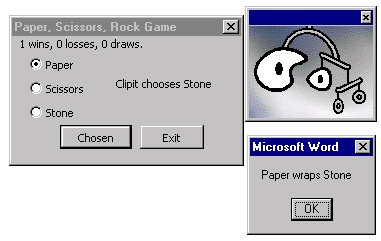

<div align="center">

## Office97 Assistant Plays Games\!\!\!


</div>

### Description

This code makes the irritating office assistant a fun playmate, he play games of Paper, Scissors, Stone...and his expressions change according to your actions!!!!
 
### More Info
 
You will need the ietimer.ocx (from ie4) to get this working, a none timer version can be easily built using this code...


<span>             |<span>
---                |---
**Submitted On**   |
**By**             |[Ed Hockaday](https://github.com/Planet-Source-Code/PSCIndex/blob/master/ByAuthor/ed-hockaday.md)
**Level**          |Unknown
**User Rating**    |5.0 (15 globes from 3 users)
**Compatibility**  |VB Script
**Category**       |[Games](https://github.com/Planet-Source-Code/PSCIndex/blob/master/ByCategory/games__1-38.md)
**World**          |[Visual Basic](https://github.com/Planet-Source-Code/PSCIndex/blob/master/ByWorld/visual-basic.md)
**Archive File**   |[](https://github.com/Planet-Source-Code/ed-hockaday-office97-assistant-plays-games__1-1219/archive/master.zip)


### Source Code

```
'This bit goes in a form
'To create the form follow these instructions
'1 Open word, go to the "tools" menu, select "macros" then "Visual Basic Editor"
'2 Make a form, call the form frmFight
'3 Add three Option buttons, call these optPaper, optScissors and optStone
'make sure the text on them says Paper, Scissors and Stone respectively
'4 Add two labels, call these lblWinsLossesDraws and lblTimerObject
'5 Add two Command buttons, call these cmdChosen and cmdExit
'6 Add the additional control "Timer Object" (ietimer.ocx)
'7 Add a timer control to the form call this tmrTimer
'8 Add the following code to the form
'Note1: This was designed to play against clipit assistant but you can use any,
'it is simple to change the animations and office97 has a full help file on this
'Note2: To convert in to Visual Basic just remove all reference to Assistant in the form
'code, and follow instructions above (for 6 just use the normal VBtimer)
'Note3: You will need the ietimer ocx to get this to work in office97 (it works in VB without)
'Note4: If you like this code please tell me at edhockaday@hotmail.com, have fun with it!!!
Option Explicit
Dim gVar1
Dim gVar2
Dim gDraw As Boolean
Dim gMessage
Dim gWins
Dim gLosses
Dim gDraws
Dim gTimerObject
Dim OptionChosen
'**************************************
'*    Macros by Ed Hockaday    *
'*       15\12\98        *
'**************************************
Public Sub sDraw()
If gVar1 = gVar2 Then
  sConvertNumberToText
  MsgBox "You both chose " & gVar1
  gDraws = gDraws + 1
  gDraw = True
  Assistant.Visible = True
  Assistant.Animation = msoAnimationLookUp
End If
End Sub
Public Sub sConvertTextToNumber()
If gVar1 = "Paper" Then
  gVar1 = 1
ElseIf gVar1 = "Scissors" Then
  gVar1 = 2
ElseIf gVar1 = "Stone" Then
  gVar1 = 3
End If
If gVar2 = "Paper" Then
  gVar2 = 1
ElseIf gVar2 = "Scissors" Then
  gVar2 = 2
ElseIf gVar2 = "Stone" Then
  gVar2 = 3
End If
End Sub
Public Sub sConvertNumberToText()
If gVar1 = 1 Then
  gVar1 = "Paper"
ElseIf gVar1 = 2 Then
  gVar1 = "Scissors"
ElseIf gVar1 = 3 Then
  gVar1 = "Stone"
End If
If gVar2 = 1 Then
  gVar2 = "Paper"
ElseIf gVar2 = 2 Then
  gVar2 = "Scissors"
ElseIf gVar2 = 3 Then
  gVar2 = "Stone"
End If
End Sub
Public Sub sVar1Win()
Assistant.Visible = True
Assistant.Animation = msoAnimationGetArtsy
MsgBox "You win"
gWins = gWins + 1
End Sub
Public Sub sVar2Win()
Assistant.Visible = True
Assistant.Animation = msoAnimationCharacterSuccessMajor
MsgBox "You lose"
gLosses = gLosses + 1
End Sub
Public Sub sReconcile()
If gVar1 = 1 Then
  If gVar2 = 3 Then
    gMessage = " wraps "
    sVar1Win
  ElseIf gVar2 = 2 Then
    gMessage = " gets cut by "
    sVar2Win
  End If
ElseIf gVar1 = 2 Then
  If gVar2 = 1 Then
    gMessage = " cuts "
    sVar1Win
  ElseIf gVar2 = 3 Then
    gMessage = " is blunted by "
    sVar2Win
  End If
ElseIf gVar1 = 3 Then
  If gVar2 = 2 Then
    gMessage = " blunts "
    sVar1Win
  ElseIf gVar2 = 1 Then
    gMessage = " gets wrapped by "
    sVar2Win
  End If
End If
End Sub
Public Sub sTimerObject()
If gTimerObject = "Paper" Then
  gTimerObject = "Stone"
ElseIf gTimerObject = "Stone" Then
  gTimerObject = "Scissors"
ElseIf gTimerObject = "Scissors" Then
  gTimerObject = "Paper"
End If
End Sub
Public Sub sLanding()
gVar2 = Int((3 * Rnd) + 1)
If gVar2 = 1 Then
  gVar2 = "Paper"
ElseIf gVar2 = 2 Then
  gVar2 = "Scissors"
ElseIf gVar2 = 3 Then
  gVar2 = "Stone"
End If
lblTimerObject.Caption = "Clipit chooses " & gVar2
End Sub
Private Sub cmdChosen_Click()
Assistant.Visible = True
Assistant.Animation = msoAnimationIdle
gTimerObject = "Paper"
gDraw = False
gMessage = ""
gVar1 = ""
'gVar2 = Int((3 * Rnd) + 1)
If gWins = "" Then gWins = "0"
If gLosses = "" Then gLosses = "0"
If gDraws = "" Then gDraws = "0"
If optPaper.Value = True Then
  gVar1 = 1
ElseIf optScissors.Value = True Then
  gVar1 = 2
ElseIf optStone.Value = True Then
  gVar1 = 3
End If
tmrTimer.Interval = 1
End Sub
Private Sub cmdExit_Click()
If gWins < gLosses Then
  With Assistant
  .Visible = True
  .Animation = msoAnimationGetAttentionMajor
    With .NewBalloon
    .Heading = "Quit while you're ahead...chicken"
    .Text = "...come on have another go?"
    .Labels(1).Text = "Yes!"
    .Labels(2).Text = "No!"
    .Mode = msoModeModal
    OptionChosen = .Show
    End With
  End With
  If OptionChosen = 1 Then
    Exit Sub
  ElseIf OptionChosen = 2 Then
    Assistant.Animation = msoAnimationDisappear
    Assistant.Visible = False
    MsgBox "Macros by Ed Hockaday - 15\12\98"
    ' Pass these macros on, but change my name and I will find you and kill you
    ' Thank you kindly!!!
    Unload frmFight
  End If
ElseIf gWins > gLosses Then
  With Assistant
  .Visible = True
  .Animation = msoAnimationGetAttentionMajor
    With .NewBalloon
    .Heading = "Hahaha I beat you..."
    .Text = "...don't you want another go?"
    .Labels(1).Text = "Yes!"
    .Labels(2).Text = "No!"
    .Mode = msoModeModal
    OptionChosen = .Show
    End With
  End With
  If OptionChosen = 1 Then
    Exit Sub
  ElseIf OptionChosen = 2 Then
    Assistant.Animation = msoAnimationDisappear
    Assistant.Visible = False
    Unload frmFight
  End If
ElseIf gWins = gLosses Then
    With Assistant
  .Visible = True
  .Animation = msoAnimationGetAttentionMajor
    With .NewBalloon
    .Heading = "Come on it's a draw..."
    .Text = "...lets finish it..."
    .Labels(1).Text = "Yes!"
    .Labels(2).Text = "No!"
    .Mode = msoModeModal
    OptionChosen = .Show
    End With
  End With
  If OptionChosen = 1 Then
    Exit Sub
  ElseIf OptionChosen = 2 Then
    Assistant.Animation = msoAnimationDisappear
    Assistant.Visible = False
    Unload frmFight
  End If
End If
End Sub
Private Sub tmrTimer_Timer()
sTimerObject
lblTimerObject.Caption = gTimerObject
tmrTimer.Interval = tmrTimer.Interval + 10
If tmrTimer.Interval > 350 Then
  tmrTimer.Interval = 0
  sLanding
  sConvertTextToNumber
  sDraw
  If gDraw = True Then
    lblWinsLossesDraws.Caption = gWins & " wins, " & gLosses & " losses, " & gDraws & " draws."
    Exit Sub
  End If
  sReconcile
  sConvertNumberToText
  lblWinsLossesDraws.Caption = gWins & " wins, " & gLosses & " losses, " & gDraws & " draws."
  MsgBox gVar1 & gMessage & gVar2
End If
End Sub
'***************************************
'This bit goes in the ThisDocument part (found in the Microsoft word object folder in the project window...)
'**************************************
'*    Macros by Ed Hockaday    *
'*       15\12\98        *
'**************************************
Sub docstart()
Dim OptionChosen As Integer
With Assistant
.Visible = True
.Animation = msoAnimationGetAttentionMajor
  With .NewBalloon
  .Heading = "Hi..."
  .Text = "...what to have some fun?"
  .Labels(1).Text = Chr(34) & "Yeah, OK!" & Chr(34)
  .Labels(2).Text = Chr(34) & "Not really!" & Chr(34)
  .Mode = msoModeModal
  OptionChosen = .Show
  End With
End With
If OptionChosen = 1 Then
  frmFight.Show
ElseIf OptionChosen = 2 Then
  No1
End If
End Sub
Private Sub Document_Open()
docstart
End Sub
Sub No1()
With Assistant
.Visible = True
.Animation = msoAnimationCharacterSuccessMajor
  With .NewBalloon
  .Heading = "Oh come on..."
  .Text = "...play with me..."
  .Labels(1).Text = "Play..."
  .Labels(2).Text = "Leave..."
  .Mode = msoModeModal
  OptionChosen = .Show
  End With
End With
If OptionChosen = 1 Then
  frmFight.Show
ElseIf OptionChosen = 2 Then
  Assistant.Animation = msoAnimationDisappear
  Assistant.Visible = False
End If
End Sub
Sub Yes1()
With Assistant
.Visible = True
.Animation = msoAnimationGetWizardy
  With .NewBalloon
  .Heading = "Fuck you small balls..."
  .Text = "...are you starting with me?"
  .Labels(1).Text = "Fight"
  .Labels(2).Text = "Run away"
  .Mode = msoModeModal
  OptionChosen = .Show
  End With
End With
If OptionChosen = 1 Then
  Fight
ElseIf OptionChosen = 2 Then
  Assistant.Animation = msoAnimationCharacterSuccessMajor
End If
End Sub
Sub Fight()
With Assistant
.Visible = True
.Animation = msoAnimationLookUp
End With
'frmFight.Show
End Sub
'*******************************************
```

